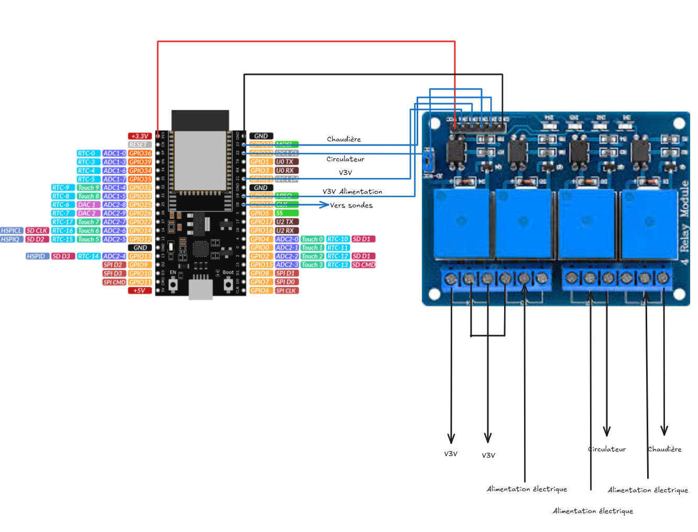

# -ESPHOME--Regulation_chauffage[DefiDIY25] Gestion d'une chaufferie
[DefiDIY25] Gestion d'une chaufferie
Bonjour à tous,

Voici mon projet de gestion de chaufferie. Actuellement je possède une chaufferie qui comprend une chaudière bois/granulé avec vanne 4 voies + ballon tampons avec production d’eau chaude.

## Gestion de la chaudière pour un plancher chauffant eau

La gestion de ma chaudière est gérée par un ESP32 + plusieurs sondes de température (5 exactement).

* 1 sonde pour le départ vers le plancher chauffant
* 1 sonde en sortie de chaudière
* 2 sondes pour extérieur (permet de pondérer la température, car placée à deux endroits différents à l’extérieur de la maison)
* 1 sonde intérieure

Le calcul de la loi d’eau permet d’avoir une température de départ (envoyé dans les circuits) en fonction de la température extérieure, intérieure et la météo à 4h. Pour la météo j'interroge l'interrogation forecast et je demande une estimation de la température 4h avant (c'est le temps approximatif pour que mon plancher réagisse) cela permet de rajouter une pondération pour le calcul de la pente. De ce fait je suis au plus près du réel et permet également d'anticiper si du soleil est prévue ou pluie.

```
float loi_eau;
      if (isnan(id(temperature_exterieur_ombre).state)) {
        loi_eau = id(pente_chauffage).state * (id(temperature_ambiante).state - id(temperature_exterieur).state) + id(parallele_chauffage).state;
      } else {
        loi_eau = id(pente_chauffage).state * (id(temperature_ambiante).state - (id(temperature_exterieur).state + id(temperature_exterieur_ombre).state + id(temperature_forecast_four_hour).state) / 3) + id(parallele_chauffage).state;
      }

      return clamp(loi_eau, 20.0f, 55.0f);
```
À partir de là cela actionne des relais contrôlés par ma carte ESPHOME :
```
 - platform: dallas_temp
    address: 0x263c7ae3815cb628
    name: "Temperature depart chauffage"
    id: temperature_depart_chauffage
    update_interval: ${delay_update_dallas}
    on_value:
      then:
        if:
          condition:
            - switch.is_off: regulation_off
          then:
            # Mode Froid
            - if:
                condition:
                  lambda: return x > id(calcul_loi_eau).state;
                then:
                  - logger.log: "****************************** Mode Froid **********************************"
                  - logger.log:
                      format: "Température de départ supérieur à la valeur de la loi d'eau %.1f"
                      args: [id(temperature_depart_chauffage).state]
                  - switch.turn_on: v3v_froid
                  - logger.log: "****************************************************************************"


            # Mode Chaud
            - if:
                condition:
                  lambda: return x < id(calcul_loi_eau).state;
                then:
                  - logger.log: "****************************** Mode Chaud **********************************"
                  - logger.log:
                      format: "Température de départ inférieur à la valeur de la loi d'eau %.1f"
                      args: [id(temperature_depart_chauffage).state]
                  - switch.turn_on: v3v_chaud
                  - logger.log: "****************************************************************************"
```
Également un système de gestion pour le nettoyage des cendres est prévu en fonction de la courbe de chauffe de la chaudière permettant de couper la chaudière quand le cycle de chauffe est fini (cela se fait via le relai d'alimentation).

Évidemment il y a quelque sécurité, pour protéger le plancher chauffant :
Si la température de départ dépasse les 55° pendant quelques minutes, je coupe le circulateur de départ + diminution de la température via la vanne 4 voies le temps que la température redevienne à la normale. Une notification est également envoyée.


Schéma de câblage :


La vanne 4 voies est réglé toutes les 30s ce qui permet d'avoir une température de départ au plus proche du calcul de la loi d'eau.

J'ai fait en sorte que le programme ESPHOME soit le plus autonome, donc même si la liaison est coupée avec Home Assistant ou si par exemple un capteur ne répond plus celui-ci fonctionnera toujours (à part pour les sondes critiques: départ de plancher chauffant).

## Gestion du cycle de chauffe du ballon d'eau chaude
ESP32 gère également la température du ballon via une sonde de température qui commande après la chauffe du ballon. Plusieurs cycles sont programmés, comme le mode vacances, mode légionelles (chauffe au-dessus de 60°). Sinon par défaut, le ballon chauffe jusqu'a atteindre ça consigne (55°).
